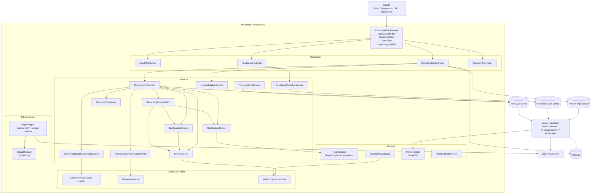
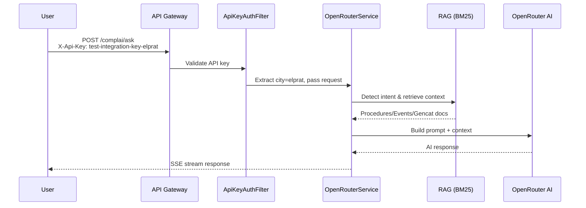
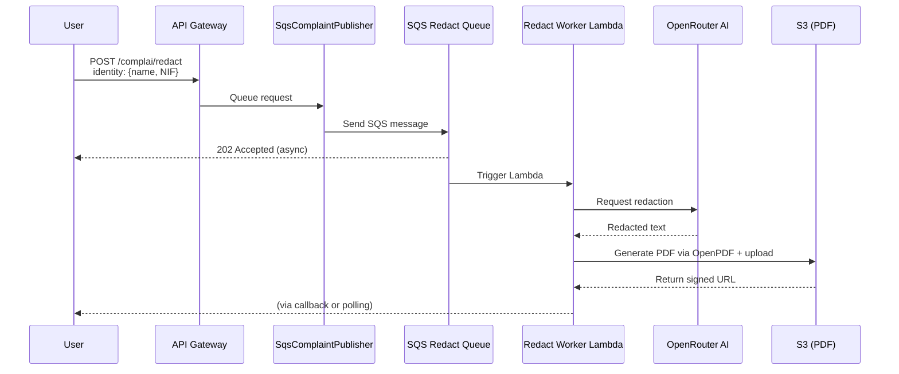
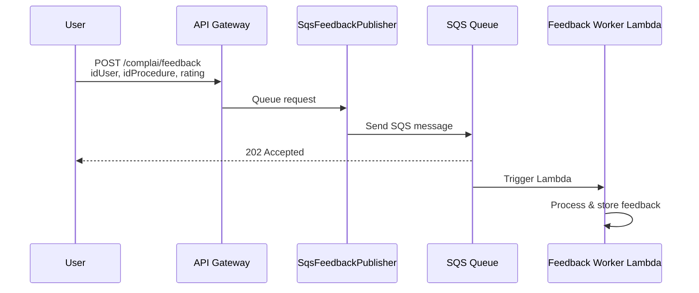
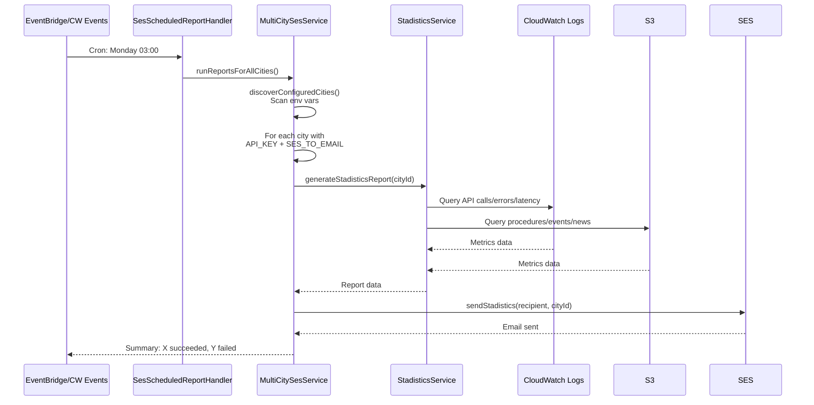

# ComplAI — Gall Potablava

[](https://github.com/raultorres2603/ComplAI/releases/latest)

> **ComplAI** — Serverless AI backend for municipal assistance in El Prat de Llobregat: citizen Q&A, complaint drafting, PDF generation, and feedback processing.

---

## Table of Contents

1. [What Is This Project?](#what-is-this-project)
2. [Vision and Goals](#vision-and-goals)
3. [Architecture Overview](#architecture-overview)
4. [Tech Stack](#tech-stack)
5. [Getting Started](#getting-started)
6. [API Reference](#api-reference)
7. [Infrastructure](#infrastructure)
8. [Security](#security)
9. [Testing](#testing)
10. [Performance Optimizations](#performance-optimizations)
11. [Conversation History (Multi-turn)](#conversation-history-multi-turn)
12. [PDF Complaint Generation](#pdf-complaint-generation)
13. [OIDC Identity Verification](#oidc-identity-verification)
14. [AI Identity and Behaviour](#ai-identity-and-behaviour)
15. [Telegram Bot](#telegram-bot)
16. [Contributing](#contributing)
17. [License](#license)

---

## What Is This Project?

ComplAI is the backend of a public-service assistant for residents of El Prat de Llobregat. Citizens can ask municipal questions, get step-by-step procedure guidance, and draft formal complaints — all through a conversational AI interface.

The assistant supports **Catalan, Spanish, and English**. It retrieves context from the city's procedures, events, news, and general municipal information using an in-memory lexical search engine (BM25) — no external database required.

Three main capabilities:

- **Municipal Q&A** — answer questions about procedures, events, and city services with SSE streaming responses.
- **Complaint drafting** — guide citizens through complaint creation and queue async PDF generation via SQS.
- **Feedback ingestion** — collect and store user feedback asynchronously for quality monitoring.

The backend is built with **Micronaut 4** and compiled to a **GraalVM native image** for production deployment on **AWS Lambda** (API Gateway HTTP API + worker functions). Infrastructure is managed with **AWS CDK (TypeScript)**.

---

## Vision and Goals

| Goal | How ComplAI addresses it |
|---|---|
| Reduce friction when citizens interact with municipal procedures | Conversational AI guides users step by step; complaint drafting automates paperwork |
| Provide multilingual assistance | Language detection + response in Catalan, Spanish, or English |
| Keep operations cost-efficient | Serverless Lambda + SQS async workers + GraalVM native image — pay only for what you use, cold starts under 100 ms |
| Keep responses grounded with local context | In-memory BM25 lexical RAG indexes procedures, events, news, and city information |
| Privacy-first design | Response cache keys contain no PII; feedback retention is short-lived |

---

## Architecture Overview

Layering present in code:

- **Controllers**: HTTP boundary and status mapping.
- **Services**: orchestration, validation, AI calls, RAG composition, clarification, streaming, redact, Telegram bot.
- **Helpers**: prompt building, language detection, HTML parsing, PDF rendering, RAG helpers.
- **Infrastructure adapters**: SQS publishers/handlers, S3 upload/signing, SES email, Telegram API calls.
- **Caches**: conversation state (Caffeine), response cache (Caffeine), circuit breaker state, Telegram session state.

### Backend request and async-processing flow



### Main E2E Flows

#### 1. Ask Flow (Chat with AI)



**Key Points:**
- City extracted from `X-Api-Key` header (e.g., `API_KEY_ELPRAT` → `elprat`)
- Intent detection: procedure, event, or gencat query
- RAG uses in-memory BM25 index (no external database)
- Response via Server-Sent Events (SSE)

#### 2. Redact Flow (PDF Complaint)



**Key Points:**
- Identity validated via OIDC (for OIDC-enabled cities)
- Async via SQS — user gets immediate 202 response
- Worker Lambda generates PDF with **OpenPDF** (replaces PDFBox for GraalVM compatibility)
- Signed S3 URL returned for download

#### 3. Feedback Flow



#### 4. SES Statistics Report Flow (Scheduled)



**Key Points:**
- Scheduled via EventBridge (production) or CloudWatch Events (SAM local)
- `MultiCitySesService` discovers cities from environment variables
- Only cities with BOTH `API_KEY_<CITYID>` AND `AWS_SES_TO_EMAIL_<CITYID>` receive reports
- Each city gets its own customized report email

---

## Tech Stack

| Layer | Technology | Notes |
|---|---|---|
| Language / Runtime | Java 25 | Production: GraalVM native image (`provided.al2023`). Local dev: JIT on `java25`. |
| Framework | Micronaut 4.10.7 | `micronautVersion` from `gradle.properties` |
| Build Tool | Gradle 9.5 (Shadow JAR) | Shadow JAR for local SAM: `complai-all.jar`. Production: GraalVM native ZIP. |
| Cloud | AWS (Lambda, API Gateway HTTP API, SQS, S3, CloudWatch, SES, CloudFront, WAF) | |
| IaC | AWS CDK (TypeScript) aws-cdk-lib ^2.237.1 | 4 stacks per environment |
| AI Integration | OpenRouter | Configurable model (default `openrouter/free`) with circuit breaker |
| Search / RAG | In-memory lexical RAG (`InMemoryLexicalIndex`) | BM25 scoring, no external Lucene dependency |
| Caching | Caffeine | Conversation state (30 min TTL), response cache (10 min TTL), rate limiter, Telegram session state |
| PDF Generation | OpenPDF 2.0.5 | Replaces Apache PDFBox — zero AWT dependency, works in GraalVM native image |
| Auth / Identity | API key (`X-Api-Key`) + OIDC ID token (`X-Identity-Token`) | JJWT 0.12.6 for OIDC validation |
| HTML Parsing | Jsoup 1.17.2 | |
| Email | Amazon SES | Weekly statistics reports |
| Tests | JUnit 5, Mockito, Bruno E2E | |

---

## Getting Started

### Prerequisites

- Java 25 (JDK)
- Docker + Docker Compose
- AWS CLI + SAM CLI
- Node.js 18+ (for CDK)
- Bruno (for E2E tests)

### Clone & Configure

```bash
git clone https://github.com/raultorres2603/ComplAI.git
cd ComplAI
cp sam/env.json.example sam/env.json
# Edit sam/env.json with your values (see Environment Variables below)
```

### Run Locally

The `sam/start-local.sh` script orchestrates the full local environment:

```bash
cd sam
./start-local.sh
```

This script:
1. Builds the shadow JAR via `./gradlew clean shadowJar`
2. Starts **LocalStack** (S3 + SQS) via Docker Compose
3. Starts **SAM local API** on `http://127.0.0.1:3000` (uses `x86_64` architecture for local Docker compatibility)
4. Starts a Python-based **SQS worker poller** to process redact/feedback messages
5. Starts a **scheduled report poller** for SES reports

**Note:** Local SAM uses a fat JAR (JIT) on `x86_64` architecture. Production deploys a GraalVM native image on ARM64 Graviton2. The architecture difference is handled by the SAM emulation layer and has no functional impact.

### Environment Variables

Key environment variables (see `sam/env.json.example` for the full list):

| Variable | Description | Example |
|---|---|---|
| `OPENROUTER_API_KEY` | OpenRouter API key | `sk-or-v1-...` |
| `API_KEY_ELPRAT` | API key for El Prat | `sk-test-elprat-...` |
| `AWS_SES_FROM_EMAIL` | Verified SES sender email | `noreply@elprathq.cat` |
| `AWS_SES_TO_EMAIL_ELPRAT` | Report recipient for El Prat | `elprat@example.com` |
| `OPENROUTER_MODEL` | OpenRouter model ID | `openrouter/free` |
| `RESPONSE_CACHE_ENABLED` | Enable response caching | `true` |
| `TOKEN_TELEGRAM_ELPRAT` | Telegram bot token for El Prat (see Telegram Bot section) | `123456:ABC-DEF1234...` |
| `TELEGRAM_WEBHOOK_SECRET_ELPRAT` | Telegram webhook secret for El Prat | `your-secret-token` |
| `AWS_ENDPOINT_URL` | LocalStack endpoint (local dev only) | `http://host.docker.internal:4566` |

---

## API Reference

| Method | Path | Auth Required | Description | Request Body | Response |
|---|---|---|---|---|---|
| `GET` | `/health` | No | Full health check (S3, SQS, SES, RAG, OpenRouter) | — | `HealthDto` |
| `GET` | `/health/startup` | No | Lightweight startup health check | — | `HealthDto` |
| `POST` | `/complai/ask` | `X-Api-Key` | Ask municipal questions (SSE stream) | `AskRequest` | `Publisher<Event<String>>` (SSE) or `OpenRouterPublicDto` (error) |
| `POST` | `/complai/redact` | `X-Api-Key` (+ `X-Identity-Token` for OIDC-enabled cities) | Complaint drafting and async PDF queueing | `RedactRequest` | `RedactAcceptedDto` (202) or `OpenRouterPublicDto` |
| `POST` | `/complai/feedback` | `X-Api-Key` | Queue user feedback for async processing | `FeedbackRequest` | `FeedbackAcceptedDto` (202) |
| `POST` | `/telegram/webhook/{cityId}` | `X-Telegram-Bot-Api-Secret-Token` | Telegram bot webhook callback | `TelegramUpdate` | `200 OK` |

### Error Codes

| HTTP Status | Meaning | Trigger |
|---|---|---|
| 200 | OK | Successful response (or synchronous redact with partial identity) |
| 202 | Accepted | Request queued for async processing (redact, feedback) |
| 400 | Bad Request | Validation error (missing fields, too long) |
| 401 | Unauthorized | Missing or invalid `X-Api-Key` (or `X-Identity-Token` for OIDC-enabled cities) |
| 422 | Unprocessable Entity | AI refusal (e.g., anonymous complaint not allowed) |
| 429 | Too Many Requests | Rate limit exceeded |
| 502 | Bad Gateway | Upstream AI API error |
| 504 | Gateway Timeout | AI API timeout |

---

## Infrastructure

Four CDK stacks per environment (`development` / `production`):

| Stack | Main resources |
|---|---|
| `ComplAIStorageStack-<env>` | S3 buckets: procedures, events, news, cityinfo, complaints, feedback, deployments |
| `ComplAIQueueStack-<env>` | SQS queues: redact + DLQ, feedback + DLQ, ask + DLQ |
| `ComplAILambdaStack-<env>` | API Lambda, Redact worker, Feedback worker, Ask worker, Scheduled report Lambda, HTTP API v2, CloudWatch metric filters |
| `ComplAIEdgeStack-production` | CloudFront distribution with WAF, geo-restriction (Spain), rate limiting (100 req/5 min per IP), 60s cache policy |

### Lambda Functions

| Function | Memory | Timeout | Runtime | Trigger | Purpose |
|---|---|---|---|---|---|
| API Lambda | 1024 MB | 60 s | `provided.al2023` (native) | API Gateway HTTP API | Serves all HTTP endpoints |
| Redact Worker | 512 MB | 60 s | `provided.al2023` (native) | SQS `complai-redact` | AI call + OpenPDF PDF generation |
| Feedback Worker | 256 MB | 60 s | `provided.al2023` (native) | SQS `complai-feedback` | Store feedback to S3 |
| Ask Worker | 256 MB | 90 s | `provided.al2023` (native) | SQS `complai-ask` | Telegram async AI responses |
| Scheduled Report | 256 MB | 60 s | `provided.al2023` (native) | EventBridge (weekly) | CloudWatch stats + SES email report |

### Deployment

```bash
cd cdk
npm install
npm run build
npx cdk deploy 'ComplAI*Stack-development'
```

CI auto-deploys to `development` on every PR. Production deploy requires a push to `master` and manual approval in GitHub Environments.

---

## Security

### API Key Authentication

All API endpoints require an `X-Api-Key` header, except health and Telegram webhook routes. The `ApiKeyAuthFilter` reads `API_KEY_<CITYID>` environment variables at startup to build an apiKey-to-cityId mapping. Requests are rejected with 401 if the key is missing or unknown.

- **Excluded routes**: `GET /health`, `GET /health/startup`, `POST /telegram/webhook/{cityId}`.
- **Telegram webhook auth**: Uses `X-Telegram-Bot-Api-Secret-Token` header verification instead of API key.

### Rate Limiting

Per-user in-process rate limiter using Caffeine (1-minute sliding window, default **20 requests/minute**). Returns HTTP 429 when exceeded. Excluded on health endpoints.

### OIDC Identity Verification

On `POST /complai/redact`, the `X-Identity-Token` header is validated for OIDC-enabled cities (configurable per city in `oidc-mapping.json`). Token validation includes issuer, audience, JWKS signature, and claim extraction. Currently disabled for all cities.

### CORS

- **Local mode**: `CorsFilter` (Micronaut filter at `HIGHEST_PRECEDENCE`) adds CORS headers and short-circuits `OPTIONS` preflight. Enabled when `complai.local-cors-enabled=true`.
- **Production**: CORS is configured at the API Gateway HTTP API level (infrastructure). The application-level filter is disabled. CloudFront adds an additional CORS layer in production.

---

## Testing

Always run the full test suite before pushing:

```bash
# Standard test run
./gradlew test

# CI-style run with verbose failure output (use before pushing)
./gradlew ciTest

# Run a single test class
./gradlew test --tests 'cat.complai.SomeTest'

# Run a single test method
./gradlew test --tests 'cat.complai.SomeTest.testMethod'
```

### Test authentication

All `@MicronautTest` HTTP integration tests must include an `X-Api-Key` header with one of these test keys:

| Key | City |
|---|---|
| `test-integration-key-elprat` | elprat |
| `test-integration-key-testcity` | testcity |
| `test-api-key-feedback` | elprat |
| `test-integration-key-elprat-htmlsources` | testcity |

**Gotcha**: `GET /health`, `GET /health/startup` are excluded from auth enforcement.

### E2E Tests (Bruno)

E2E tests live in `E2E-ComplAI/` (Bruno collection). Install the Bruno desktop app or CLI, import the collection, select the `Local` or `Development` environment, and run the `02-OK` folder for happy-path validation.

---

## Performance Optimizations

- **GraalVM native image** — eliminates JIT warmup, reduces baseline memory by ~70% vs. JVM JIT. Cold starts under 100 ms at 1024 MB. Enables lower memory configurations for worker Lambdas (256 MB).
- **Conversation cache** with 30-minute TTL and configurable max turns (default 5).
- **Response cache** with privacy-preserving hash keys (cache keys contain only `cityId` + procedure/event hashes + question category — never user queries).
- **In-memory lexical RAG index** (BM25) — no external database dependency.
- **Common response pre-population** — top ~20 most common municipal queries cached at startup via `common-ai-requests.json`.
- **Async queue-based** complaint and feedback processing via SQS.
- **CloudFront CDN caching** — GET/OPTIONS responses cached for 60 seconds in production.
- **Circuit breaker** per-city/per-model to fail fast when OpenRouter error rate exceeds 50%, with automatic recovery after cooldown.

### Lambda Memory Configuration

| Function | Memory | Rationale |
|---|---|---|
| API Lambda | 1024 MB | Verified via AWS Lambda Power Tuning on native image. Handles SSE streaming + concurrent requests (burst up to 10). |
| Redact Worker | 512 MB | OpenPDF has zero AWT dependency (unlike PDFBox). Font (615 KB) cached after first load. AI call dominates latency. |
| Feedback Worker | 256 MB | I/O-bound JSON in/out + S3 upload. Further reduction offers no cost benefit (CPU proportionality floor). |
| Ask Worker | 256 MB | I/O-bound: RAG context + AI network wait. Production log: 169 MB peak cold start with full RAG warmup. |
| Scheduled Report | 256 MB | Weekly I/O-bound task. CloudWatch API calls dominate; memory for HTML generation is modest. |

---

## Conversation History (Multi-turn)

Conversation context is stored by `conversationId` in a Caffeine in-memory cache with:

- **TTL**: 30 minutes
- **Max turns**: 5 (configurable, default 5 user+assistant pairs)
- **Max entries**: 10 000

The `ConversationManagementService` provides append/retrieve/clear operations. Pending complaints and pending clarifications are also tracked per conversation.

---

## PDF Complaint Generation

When a citizen provides complete identity (`given_name`, `family_name`, `NIF`), the `POST /complai/redact` endpoint:

1. Validates identity completeness.
2. Queues the request to the SQS redact queue (`complai-redact-<env>`).
3. Returns HTTP 202 with the `conversationId` and a presigned S3 URL.

The **Redact Worker Lambda** processes the message:
1. Calls OpenRouter for complaint text generation.
2. Generates a PDF via **OpenPDF** (replaces Apache PDFBox — zero AWT dependency required by GraalVM native image).
3. Uploads the PDF to the complaints S3 bucket (`complai-complaints-<env>`).
4. Returns a signed S3 URL for download.

If identity is incomplete, the response includes a clarification request.

---

## OIDC Identity Verification

ComplAI supports **OpenID Connect (OIDC) ID token** verification for identity validation on the redact endpoint.

| Provider | Status | Issuer |
|---|---|---|
| Cl@ve (via AOC) | Disabled (configurable per city) | `https://identitats.aoc.cat` |
| VALId (via AOC) | Disabled (configurable per city) | `https://identitats.aoc.cat` |
| idCat (via AOC) | Disabled (configurable per city) | `https://identitats.aoc.cat` |

**Validation flow**:
1. Client sends `X-Identity-Token` header on `POST /complai/redact`.
2. `OidcIdentityTokenValidator` checks if the city is OIDC-enabled in `oidc-mapping.json`.
3. If enabled: fetches JWKS from the issuer's JWKS URI, validates the token's signature, issuer, and audience.
4. Extracts identity claims (`given_name`, `family_name`, NIF) from the validated token.

City-specific OIDC configuration is bundled in `src/main/resources/oidc/oidc-mapping.json`. No environment variables required — the per-city `enabled` flag controls activation.

---

## AI Identity and Behaviour

- **Model**: Configurable via `OPENROUTER_MODEL` environment variable (default `openrouter/free`).
- **Language detection**: Automatic detection of Catalan, Spanish, or English from user input. The AI responds in the detected language.
- **System prompt strategy**: Context-aware prompt composition including retrieved RAG documents (procedures, events, news, city info), conversation history, and civic vocabulary expansion.
- **Civic vocabulary**: The `CivicVocabularyService` expands English/Spanish/French user queries with Catalan civic synonyms for improved cross-language retrieval.
- **Guardrails**: The assistant refuses to draft anonymous complaints (the Ajuntament does not accept them). Off-topic queries beyond municipal scope are detected and politely declined.
- **Redact prompt**: A specialized `RedactPromptBuilder` constructs prompts for formal complaint letter generation with proper legal formatting.

---

## Telegram Bot

ComplAI includes a **Telegram Bot** integration that allows citizens to interact with the municipal AI assistant directly through Telegram. The bot supports multi-city deployments — each city has its own bot token and webhook secret.

### Architecture

```
Telegram → POST /telegram/webhook/{cityId} → TelegramController
                                                 ↓
                                          TelegramBotService
                                           ↙        ↓        ↘
                              OpenRouterServices  SQS Queue  FeedbackPublisher
```

- **Webhook endpoint**: `POST /telegram/webhook/{cityId}` — receives updates from Telegram
- **Auth**: Excluded from `X-Api-Key` filter; secured via `X-Telegram-Bot-Api-Secret-Token` header
- **Bot token**: Resolved from `TOKEN_TELEGRAM_<cityId>` environment variable at startup
- **Session state**: Per-chat mode/language stored in Caffeine cache (30 min TTL)
- **Async AI**: For complaint drafting and feedback, the bot publishes messages to SQS queues. The **Ask Worker Lambda** processes Telegram ask jobs asynchronously — it calls the AI and sends the answer back via the Telegram Bot API.

### Setup

1. **Create a bot** via [@BotFather](https://t.me/botfather) on Telegram and get the API token.
2. **Set the environment variables** for each city:
   ```bash
   TOKEN_TELEGRAM_ELPRAT=123456:ABC-DEF1234ghIkl-zyx57W2v1u123ew11
   TELEGRAM_WEBHOOK_SECRET_ELPRAT=your-random-secret-token
   ```
3. **Register the webhook** with Telegram (run once per bot):
   ```bash
   curl -X POST "https://api.telegram.org/bot<TOKEN>/setWebhook" \
     -d "url=https://<your-api-gateway-url>/telegram/webhook/elprat" \
     -d "secret_token=<YOUR_WEBHOOK_SECRET>"
   ```
   Replace `<TOKEN>` with your bot token, `<your-api-gateway-url>` with the deployed API Gateway endpoint, and `<YOUR_WEBHOOK_SECRET>` with the same value set in `TELEGRAM_WEBHOOK_SECRET_ELPRAT`.

4. **Verify the webhook**:
   ```bash
   curl -X POST "https://api.telegram.org/bot<TOKEN>/getWebhookInfo"
   ```

### Commands

| Command | Description |
|---|---|
| `/start` | Welcome message with inline keyboard (Ask, Complaint, Feedback, Language) |
| `/mode` | Show mode selection keyboard |
| `/help` | Show available commands and usage |
| `/language` | Change language (Català / Español / English) |

### Flows

| Mode | Flow |
|---|---|
| **Ask** | User types a question → bot sends "typing" action → calls OpenRouter API → sends answer via Telegram synchronous API |
| **Complaint** | Collect complaint text → collect identity (name, surname, NIF) → publish to SQS → worker Lambda calls AI → sends presigned PDF URL via Telegram |
| **Feedback** | Collect suggestion text → publish to SQS feedback queue → confirmation message |

### Multi-city Support

The bot automatically discovers cities by scanning env vars at startup. To add a new city:
1. Set `TOKEN_TELEGRAM_<CITYID>` and optionally `TELEGRAM_WEBHOOK_SECRET_<CITYID>`
2. Register the webhook with Telegram pointing to `/telegram/webhook/<cityId>`
3. The city displays its name automatically (add a mapping in `TelegramBotService.resolveCityDisplayName()` for custom display names)

### Files

| Layer | File |
|---|---|
| Controller | `controllers/telegram/TelegramController.java` |
| Service | `services/telegram/TelegramBotService.java` |
| Session Store | `services/telegram/TelegramSessionStore.java` |
| Configuration | `config/TelegramConfiguration.java` |
| DTOs | `controllers/telegram/dto/Telegram*.java` (11 records) |
| Tests | `controllers/telegram/TelegramControllerTest.java`, `services/telegram/TelegramBotServiceTest.java` |

---

## Contributing

- **Branch strategy**: feature branches off `master`.
- **Code style**: constructor injection only, Micronaut conventions, Javadoc on all public methods.
- **PR guidelines**: all tests must pass. Run `./gradlew ciTest` before opening a PR.
- **Copilot agents**:
  - `@planner` — plan a new feature
  - `@builder` — implement a planned feature
  - `@documentator` — keep the README up to date

---

## License

Copyright (c) 2026 Raul Torres Alarcon. All Rights Reserved.

This source code is provided for reference only. No copying, reproduction, modification, distribution, or use is permitted without explicit written permission from the copyright holder.
