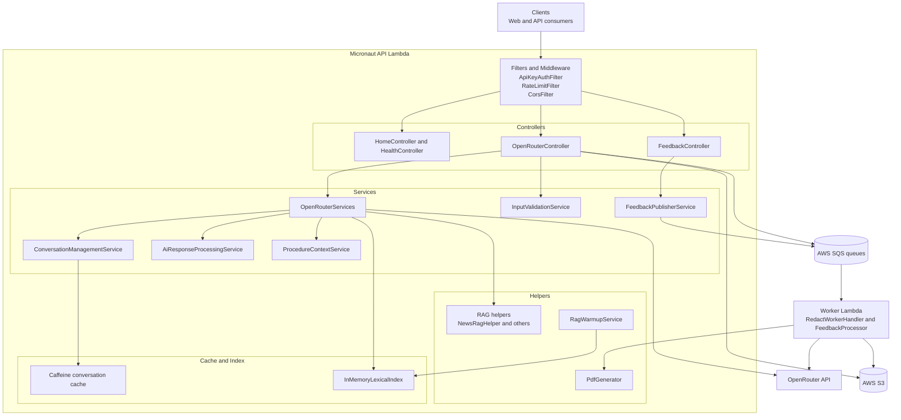

# ComplAI - Gall Potablava

[](https://github.com/raultorres2603/ComplAI/releases/latest)

Serverless AI backend for municipal assistance in El Prat de Llobregat: citizen Q&A, complaint drafting, and asynchronous PDF generation.

## Table of Contents
1. [Project Overview](#project-overview)
2. [Vision and Goals](#vision-and-goals)
3. [Tech Stack](#tech-stack)
4. [Architecture Overview](#architecture-overview)
5. [Implemented API Endpoints](#implemented-api-endpoints)
6. [Auth, Rate Limiting, and CORS](#auth-rate-limiting-and-cors)
7. [Integrations](#integrations)
8. [Getting Started (Local)](#getting-started-local)
9. [Testing](#testing)
10. [Infrastructure (CDK)](#infrastructure-cdk)
11. [Configuration](#configuration)
12. [Performance Optimizations](#performance-optimizations)
13. [Conversation History (Multi-turn)](#conversation-history-multi-turn)
14. [PDF Complaint Generation](#pdf-complaint-generation)
15. [AI Identity and Behaviour](#ai-identity-and-behaviour)
16. [Contributing](#contributing)
17. [License](#license)

## Project Overview
ComplAI is the backend of a public-service assistant for residents of El Prat de Llobregat.

Current capabilities:
- Municipal question answering.
- Complaint drafting workflows.
- Asynchronous complaint PDF generation.
- Asynchronous feedback ingestion.

The backend is built with Micronaut and deployed on AWS Lambda.

## Vision and Goals
- Reduce friction when citizens interact with municipal procedures.
- Provide multilingual assistance (Catalan, Spanish, English).
- Keep operations cost-efficient with serverless infrastructure.
- Keep responses grounded with local retrieval context.

## Tech Stack

| Area | Current implementation |
|---|---|
| Language / runtime | Java 25 |
| Framework | Micronaut 4.10.7 |
| Build tool | Gradle (Shadow JAR: complai-all.jar) |
| IaC | AWS CDK (TypeScript, cdk/) |
| Cloud services | AWS Lambda, API Gateway HTTP API, SQS, S3, CloudWatch, optional WAF (production) |
| AI provider | OpenRouter |
| RAG | In-memory lexical retrieval (InMemoryLexicalIndex, no Lucene dependency) |
| Caching | Caffeine (conversation and response caches) |
| PDF | Apache PDFBox |
| Auth / identity | API key auth (X-Api-Key) and OIDC ID token validation (X-Identity-Token) with JJWT |
| HTML parsing | Jsoup |
| Tests | JUnit 5, Mockito, Bruno E2E |

## Architecture Overview
Layering present in code:
- Controllers: HTTP boundary and status mapping.
- Services: orchestration, validation, AI calls, RAG composition.
- Helpers: prompt building, language detection, parsing, PDF rendering.
- Infrastructure adapters: SQS publishers/handlers and S3 upload/signing.
- Caches: conversation state and short-lived response cache.

Current backend request and async-processing flow:



## Implemented API Endpoints

| Method | Path | Auth | Purpose |
|---|---|---|---|
| GET | / | Public | Home/welcome response |
| GET | /health | Public | Full health check |
| GET | /health/startup | Public | Lightweight startup health check |
| POST | /complai/ask | X-Api-Key | Ask municipal questions (SSE stream, JSON on early error) |
| POST | /complai/redact | X-Api-Key; X-Identity-Token only applies to OIDC-enabled cities | Complaint drafting and async PDF queueing |
| POST | /complai/feedback | X-Api-Key | Queue user feedback for async processing |

## Auth, Rate Limiting, and CORS
- API key enforcement: all POST routes require X-Api-Key.
- Public route exceptions: GET /, GET /health, GET /health/startup.
- OIDC on redact: X-Identity-Token is evaluated only for POST /complai/redact; if the city is OIDC-enabled in oidc/oidc-mapping.json, the token is required and validated.
- Rate limiting: per-user in-process limiter using Caffeine; excluded only on GET /, GET /health, GET /health/startup.
- CORS preflight: OPTIONS requests are allowed without API key. In local mode, CorsFilter handles preflight and adds CORS headers; in deployed environments, CORS is configured at infrastructure level.

## Integrations
- OpenRouter chat completions.
- AWS SQS for asynchronous complaint and feedback workflows.
- AWS S3 for corpora and generated artifacts.
- Apache PDFBox for PDF generation.
- In-memory lexical RAG.
- OIDC ID token validation via JJWT.

## Getting Started (Local)
Prerequisites:
- Java 25
- Docker
- AWS SAM CLI

```bash
cp sam/env.json.example sam/env.json
cd sam
./start-local.sh
```

## Testing

```bash
./gradlew test
./gradlew ciTest
```

E2E tests are in E2E-ComplAI (Bruno collection).

## Infrastructure (CDK)

| Stack | Main resources |
|---|---|
| ComplAIStorageStack-<env> | S3 buckets |
| ComplAIQueueStack-<env> | SQS queues and DLQs |
| ComplAILambdaStack-<env> | API Lambda, worker Lambdas, HTTP API |
| ComplAIWafStack-production | WAF for production API |

```bash
cd cdk
npm install
npm run build
npx cdk synth
npx cdk deploy 'ComplAI*Stack-development'
```

## Configuration

### Amazon SES (Simple Email Service)

ComplAI uses Amazon SES for sending complaint statistics reports and notifications.

**Configuration Bean**: `cat.complai.config.SesConfiguration` (`@ConfigurationProperties("aws.ses")`)

**Required GitHub Actions Secrets**:
| Secret | Description | Example |
|---|---|---|
| `AWS_SES_FROM_EMAIL` | Verified sender email in AWS SES | `noreply@elprathq.cat` |
| `AWS_SES_REGION` | AWS region for SES (optional) | `eu-west-1` |

**Environment Variable Mapping** (application.properties):
```properties
aws.ses.from-email=${AWS_SES_FROM_EMAIL:}
aws.ses.region=${AWS_SES_REGION:eu-west-1}
```

**Pre-deployment Requirements**:
1. Verify the sender email in AWS SES console (sandbox or production mode)
2. For production, request production access quota increase (AWS approval required)
3. Ensure Lambda execution role has `ses:SendEmail` permission (configured in CDK lambda-stack.ts)

**Micronaut Configuration**:
- SES configuration is injected into `EmailService` via dependency injection
- Application startup will fail immediately if `AWS_SES_FROM_EMAIL` is missing or invalid
- Per-environment configuration is supported via separate environment variable values in GitHub Actions

**Local Testing**:
- Use test email values in `src/test/resources/application.properties`
- Mock SES client in unit tests (no real AWS calls)
- For SAM local testing, set environment variables in `sam/env.json`

**Validation**:
- Email validation performed at application startup via `@Email` annotation
- Invalid or missing sender email causes immediate startup failure (fail-fast)
- SES SDK errors are logged with context for troubleshooting

## Performance Optimizations
- Conversation cache with TTL and turn cap.
- Response cache with privacy-preserving hash keys.
- In-memory lexical RAG index.
- Async queue-based complaint and feedback processing.

## Conversation History (Multi-turn)
Conversation context is stored by conversationId with a 30-minute TTL and configurable max turns (default 5).

## PDF Complaint Generation
When identity is complete, redact requests are queued to SQS and processed by a worker Lambda that generates a PDF with PDFBox and uploads to S3.

## AI Identity and Behaviour
OpenRouter model selection is configurable via OPENROUTER_MODEL. Language detection and context-aware prompt composition are implemented in service/helper layers.

## Contributing
Follow the existing layered architecture and run tests before proposing changes.

## License
Copyright (c) 2026 Raul Torres Alarcon. All Rights Reserved.

This source code is provided for reference only. No copying, reproduction, modification, distribution, or use is permitted without explicit written permission from the copyright holder.
